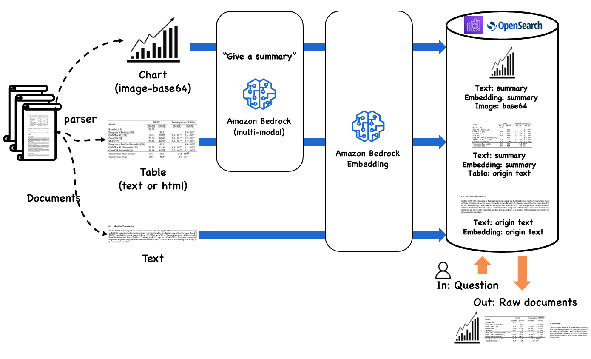

# AWS Generative AI PoC : PDF RAG
#### <i>for SC&T Trading</i>

## 실행 환경
- Amazon SageMaker Studio - JupyterLab (Classic 아님)

## 주피터 노트북을 순서대로 실행하세요.
- 공통 : 01, 02 번 노트북은 환경설정 부분 입니다.
  
- <b>Complex PDF RAG</b>
  > 13 번 노트북은 OpenSearch에 PDF를 인덱싱 합니다.  
  > 14 번 노트북은 RAG 기반 질의 응답을 합니다.

 

- <b>Simple PDF RAG</b>
  > 23 번 노트북은 PDF를 PDFPlumber로 파싱하여 인덱싱 하고, RAG 기반 질의 합니다. (Hybrid Search)  
  > 24 번 노트북은 PDF를 LLAMA-INDEX로 파싱하여 인덱싱 하고, RAG 기반 질의 합니다. (Hybrid Search)

 

- <b>Simple PDF Q&A</b>
  > 31 번 노트북은 PDF를 PDFPlumber로 파싱하고, 챕터 별 요약을 수행 합니다. (no RAG)  
  > 32 번 노트북은 PDF를 PDFPlumber로 파싱하고 Quiz 챗봇 형태로 동작 합니다. (no RAG)

 

- <b>Simple PDF Summary</b>
  > 41 번 노트북은 PDF를 페이지마다 PNG로 변환해서 이미지로 Claude 에 입력하여 요약합니다. (no RAG)  
  > 42 번 노트북은 앞서 이미지 기반으로 정리한 내용과 PDF 파서(PyMuPdf)의 내용을 결합하여 소제목 별로 요약합니다. (no RAG)

 

## [그림] Complex PDF RAG flow

---

Complex RAG 원본 소스는 아래 aws-samples git repo를 참조하세요. 
[RAG over Complex PDF on AWS](https://github.com/aws-samples/aws-ai-ml-workshop-kr/tree/c3d2185f419790905a2879284bf0c050355e0702/genai/aws-gen-ai-kr/20_applications/02_qa_chatbot/10_hands_on_lab/02_rag_over_complex_pdf)